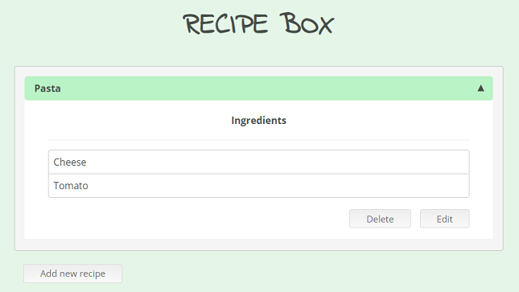

# Recipe Box

Full stack project for managing recipes. We can create, delete or edit recipes that have names and ingredients.



### Tech

This project uses a number of open source projects to work properly:

* [Node.js] - evented I/O for the backend
* [Express] - fast Node.js network app framework 
* [MongoDB] - document-oriented database program
* [React] - library for building user interfaces
* [Redux] - library for managing application state
* [Mocha] - Test framework running on Node.js
* [Chai] - BDD / TDD assertion library
* [Jest] - Delightful JavaScript Testing

### Installation

Install the dependencies and devDependencies and start the server.

```sh
$ cd recipe-box
```
Server
```sh
$ npm install -d
```
Client
```sh
$ npm run client-install
```

### Development

Open your favorite Terminal and run these commands.
```sh
$ cd recipe-box
$ npm run dev
```
Server
```sh
$ npm run server
```
Client
```sh
$ npm run client
```

### Tests

Server
```sh
$ cd recipe-box
$ npm run test
```
Client
```sh
$ cd recipe-box/client
$ npm run test
```

### Todos
 - Connect the Backend  
 - Write MORE Tests
 - Deployment
 - Refactoring
 
### License

ISC

---

LinkedIn: www.linkedin.com/in/deiglesias 

Twitter: [@DenetIglesias]

   [Node.js]: <http://nodejs.org>
   [express]: <http://expressjs.com>
   [MongoDB]: <http://www.mongodb.com/>
   [React]: <http://reactjs.org/>
   [Redux]: <https://redux.js.org/introduction>
   [Mocha]: <https://mochajs.org/>
   [Chai]: <https://www.chaijs.com/>
   [Jest]: <https://jestjs.io/>
   [@DenetIglesias]: <https://twitter.com/DenetIglesias>


